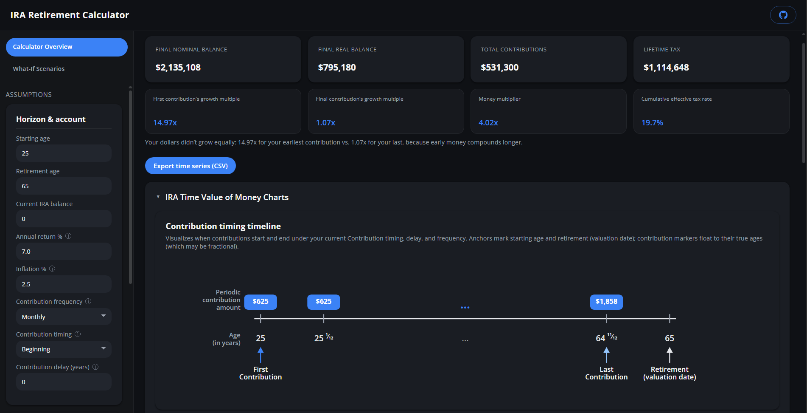
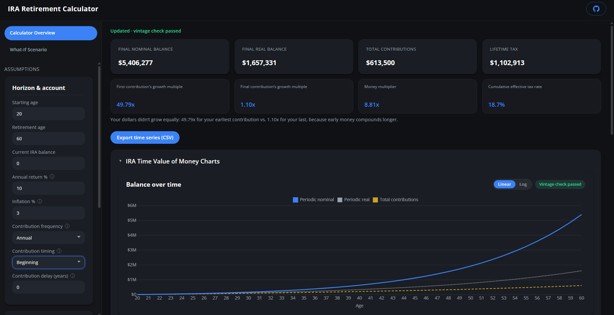
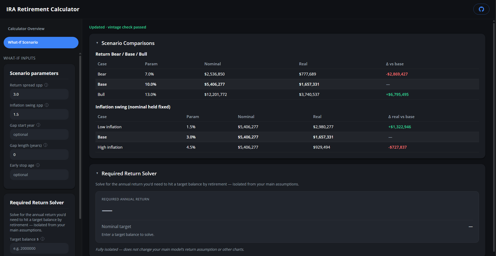

# Actuarial IRA Projection Model

A Roth IRA retirement calculator with progressive federal tax modeling, real IRS eligibility rules, and actuarial career projections. 

## Table of Contents

- [Overview](#overview)
- [Why I Built This](#why-i-built-this)
- [Live Demo](#live-demo)
- [Screenshots](#screenshots)
- [Features](#features)
- [Tech Stack](#tech-stack)
- [Setup](#setup)
- [Methodology](#methodology)
- [Assumptions and Limitations](#assumptions-and-limitations)
- [Quality Assurance](#quality-assurance)
- [Future Improvements](#future-improvements)
- [About Me](#about-me)
- [Suggestions](#suggestions)


## Overview

This project is a Roth IRA projection model that applies Actuarial Exam Financial Mathematics (FM) concepts to a realistic personal finance and actuarial career scenario. Originally built in Excel and rebuilt as a FastAPI web app, it shows how contribution timing, investment returns, inflation, IRA contribution limits, salary growth, taxes, and career progression can affect long-term retirement outcomes.

The app uses a transparent year-by-year calculation engine so users can follow how each assumption affects the results. It also supports periodic contributions, including monthly, weekly, and advanced trading-day contribution schedules.

In addition to projecting Roth IRA balances, the model estimates gross salary, federal income tax, payroll taxes, optional state income tax, disposable take-home pay, retirement milestones, and what-if scenarios.

This project is intended to demonstrate my understanding of time value of money, annuities, compound interest, financial modeling, assumption management, and actuarial-style quality control. It is an educational model and is not intended to provide tax, legal, investment, or financial advice.

## Why I Built This

I built this project because most popular online Roth IRA calculators are too simplified for long-horizon planning. Tools like [NerdWallet](https://www.nerdwallet.com/investing/calculators/roth-ira-calculator) or [Calculator.net](https://www.calculator.net/ira-calculator.html) are useful for a quick estimate, but they treat annual contributions as a flat input held constant for decades. In reality, IRS IRA contribution limits (and catch-up amounts) are inflation-indexed over time, so a multi-decade projection that never lifts that ceiling understates how much a disciplined saver can put away.

Those calculators also leave out much of the surrounding tax and eligibility mechanics that shape Roth outcomes over a career. NerdWallet applies current-year income limits to size this year's contribution, but neither tool projects inflation-indexed contribution ceilings forward, and neither models year-by-year progressive federal brackets, payroll taxes, evolving MAGI phase-outs (including Direct vs Backdoor paths), or contribution caps tied to earned income. Few of them model an actuarial-style career path with exam and credential raises.

I first built the model in Excel. That workbook was the right place to get the math right: a transparent year-by-year engine for Exam FM time-value-of-money logic, progressive taxes, IRA limits, and career assumptions. It became a separate audited reference model and the foundational building block for this app's engine logic. I used it for independent verification while rebuilding the calculations in Python, not as a downloadable deliverable in this repository.

The limitation was the product experience. Spreadsheet tabs multiplied as the model grew, and there was no cohesive dashboard. With as many inputs and paths as the scenario allows (visible in the live app), I could not keep the variable inputs on one usable surface alongside the outputs, charts, and what-if comparisons. That friction is what pushed the next step: the same verified engine, rebuilt as a FastAPI web app with a single interactive interface.

## Live Demo

Try the app here: [https://actuarial-ira-calculator.onrender.com/](https://actuarial-ira-calculator.onrender.com/)

## Screenshots

### Contribution Timing Timeline



### Calculator Overview



### What-If Scenarios



## Features

Every chart, table, milestone, and diagram in the app is live. Nothing is a static image or a pre-rendered example. Changing any assumption in the sidebar recalculates the entire model and redraws every visual against the new result, including the timeline diagram, which reshapes itself around the contribution schedule rather than illustrating a fixed textbook case.

### Calculator Overview

#### Summary Statistics

The top of the tab reports the headline results: final nominal balance, final real balance, total contributions, and lifetime tax. A second row reports the growth-multiple story behind those numbers: the first contribution's growth multiple, the final contribution's growth multiple, the money multiplier (ending balance divided by total contributions), and the cumulative effective tax rate across the whole horizon.

#### Contribution Timing Timeline

A schematic diagram of the actual annuity structure the model is solving, drawn from the live inputs rather than a fixed illustration. It redraws to reflect three things at once:

- **Annuity type.** Beginning-of-period timing (annuity due) places the first contribution at the starting age and the last one period before retirement. End-of-period timing (annuity immediate) shifts both by one period.
- **Contribution frequency.** Annual, semiannual, quarterly, monthly, weekly, or a custom trading-day interval. Sub-annual frequencies produce fractional contribution ages, which the diagram displays as mixed numbers (for example, age 64 and 11/12 for a monthly annuity-due final contribution).
- **Deferred start.** A contribution delay pushes the first contribution forward by that many years, so a two-year deferral with monthly end-of-period timing correctly lands the first contribution at age 27 and 1/12, visually separated from the starting-age anchor.

The starting age and retirement (valuation date) anchors stay fixed while the contribution markers float to their true computed positions, so the gap between when the horizon starts and when contributions actually begin is visible rather than implied.

#### Balance over Time

Nominal balance, real (inflation-adjusted) balance, and cumulative contributions plotted against age, with a linear/logarithmic y-axis toggle for scenarios spanning several orders of magnitude. The vintage cross-check status is surfaced directly on this chart as a badge.

#### Purchasing Power Retained

Real balance as a percentage of nominal balance over the horizon. Because that ratio reduces to the inflation discount factor alone, this curve is independent of investment return: it shows what a dollar's purchasing power does over time regardless of where the dollar sits. It is effectively the answer to what would happen if the money were held as cash under a mattress instead of earning any return, which makes the erosion side of the projection visible separately from the growth side.

#### Growth Multiple by Contribution Age

How many times over each year's contributions grow by retirement, plotted by the age at which they were contributed. The curve declines from left to right, which is the point: dollars contributed early compound for decades while dollars contributed near retirement barely compound at all. The same contribution amount is not worth the same thing depending on when it goes in.

#### Annual Contributions and Terminal Value

Each year's contribution plotted against what that specific contribution grows into by retirement, so the compounding gap between an early and a late dollar is visible in dollar terms rather than as a multiple.

#### Milestones

Four milestone lists, each filtered to what the scenario actually reaches rather than fixed thresholds: balance milestones as a share of the scenario's own final balance, nominal balance milestones at round dollar thresholds, salary milestones across the modeled salary range, and compounding milestones showing the ages at which the money doubles through pure compound growth (the Rule of 72 in practice).

#### Tax and Allocation Detail

- **Annual Take-Home Pay.** A stacked annual cash-flow chart breaking gross salary into federal income tax, optional flat state tax, payroll taxes (OASDI, Medicare, and Additional Medicare), and remaining take-home pay. The segments sum to modeled gross salary each year, so the shifting composition of a paycheck as income rises through progressive brackets is directly readable.
- **Annual Tax Detail.** A year-by-year extension of the same breakdown, isolating the tax components on their own axis.
- **Cumulative Tax Summary and Lifetime Income Allocation.** A summary table alongside a pie chart partitioning total lifetime gross salary into its end uses: taxes by type (federal, state, payroll), Roth IRA contributions, and retained income after both.

#### Year-by-Year Time Series

The full underlying projection as a table: salary, contribution, contribution method, limits, balances, taxes, and cumulative doublings for every modeled year. Exportable to CSV, which is what made the Excel cross-verification described below possible in the first place.

### What-If Scenarios

Every scenario on this tab runs as an isolated shadow calculation. None of them modify the base model, its charts, or its assumptions.

#### Scenario Comparisons

Bear, base, and bull cases computed as a spread around the user's own return assumption rather than fixed absolute rates, so the comparison scales with whatever base case was entered. Inflation swing scenarios do the same for the inflation assumption, reported against the real balance since nominal balance is unaffected by inflation. The tab also models a contribution gap (a career break with a user-specified start year and length, after which contributions resume) and an early stop age (contributions end permanently while the existing balance keeps compounding to retirement).

#### Required Return Solver

Answers the inverse question: given the contribution schedule and everything else held fixed, what constant annual return is required to reach a target balance? The target can optionally be entered in real terms, so the question becomes what return is needed for a given amount of future purchasing power rather than a given nominal dollar figure. The solver converts a real target to its nominal equivalent before solving. The implementation is a real numerical root-find (bracket and bisect), not a spreadsheet Goal-Seek workaround, and it reports when a target is unreachable rather than silently failing. See [Methodology](#methodology) for the full derivation.

### Actuary Mode and Career Modeling

#### Actuary Mode

Models the salary trajectory of an actuarial career specifically, rather than applying a flat merit raise for forty years. Exam passes, Associate credentialing (ASA or ACAS), and Fellowship (FSA or FCAS) each contribute their own raise on their own timeline, layered on top of the base merit raise. The model is credential-status aware: if the user is already an Associate or Fellow, the corresponding raises are excluded rather than double-counted, on the assumption that an already-credentialed user's entered starting salary already reflects them. Timing inputs are validated against each other, so Fellowship cannot be modeled as arriving before the exams that precede it.

#### Salary Cap

An optional ceiling on modeled salary growth, for scenarios where a career plateaus at a senior level. Salary grows normally until it reaches the cap and then holds flat, including against exam and credential raises that would otherwise push it past the ceiling.

#### Filing Status Transition

Filing status can change partway through the projection (marriage being the common case), with the model switching to the new status's brackets, standard deduction, payroll thresholds, and Roth MAGI phase-out bands at the specified year.

#### Optional Flat State Tax

A flat-rate state income tax estimate applied to federal taxable income, clearly labeled as illustrative rather than a real state tax model.

## Tech Stack

The backend is a Python FastAPI service with Pydantic-validated inputs and a single `POST /api/calculate` endpoint that returns the full projection as JSON. The frontend is vanilla HTML, CSS, and JavaScript with no build step, and Chart.js (via CDN) for the charts. The UI is a dark, fintech-style layout with two tabs: Calculator Overview for the main projection, and What-If Scenarios for isolated shadow calculations.

## Setup

The easiest way to use the app is the [live demo](#live-demo), no installation required. Note that free-tier Render instances spin down when idle, so the first request after a period of inactivity can take a few seconds to wake up; results are otherwise deterministic for the same inputs.

To run it locally instead:

```bash
cd IRA
pip install -r requirements.txt
python -m uvicorn backend.app:app --reload
```

Then open `http://127.0.0.1:8000`. FastAPI serves both the `/api/calculate` endpoint and the static frontend (`index.html`, `style.css`, `app.js`) from the same process, so one command is enough. To run the test suite: `python -m pytest -q`.

## Methodology


#### Compound Interest

The model uses a year-by-year time value of money framework. Account balances grow based on the selected effective annual investment return.

#### Annuities

Roth IRA contributions are modeled as recurring annuity contributions. The model supports both beginning-of-period and end-of-period contribution timing.

#### Periodic Effective Returns

For periodic contributions, the annual effective investment return is converted to an effective return per period:

$$
i_p = (1+i)^{1/m}-1
$$

where $i$ is the annual effective investment return and $m$ is the number of contribution periods per year.

In this equation:

- $i_p$: effective investment return per contribution period.
- $i$: nominal effective annual investment return.
- $m$: number of contribution periods per year.

The annual modeled Roth IRA limit is indexed once per projection year and then divided across the selected contribution periods. It is not indexed separately during each month, week, or trading-day period.

#### IRA-Limit Indexing

The model uses an illustrative indexed IRA limit. Because the IRS does not publish the intermediate unrounded indexing value used to determine future contribution limits, the model treats the published 2026 regular limit and catch-up limit as the starting index values. Future unrounded values are projected using the user’s inflation assumption and rounded downward using the modeled statutory increments.

#### Real-Dollar Conversion

The Fisher equation describes the relationship between nominal returns, real returns, and inflation:

$$
1+i = (1+r)(1+\pi)
$$

Solving for the real return:

$$
r = \frac{1+i}{1+\pi}-1
$$

In these equations:

- $r$: real effective annual investment return after adjusting for inflation.
- $\pi$: effective annual inflation rate.

For future balances, the model applies the cumulative form of this relationship. A nominal balance is divided by the cumulative inflation index to estimate its purchasing power in today’s dollars:

$$
\text{Real Balance}_t = \frac{\text{Nominal Balance}_t}{\text{Cumulative Inflation Index}_t}
$$

If inflation is constant:

$$
\text{Cumulative Inflation Index}_t = (1+\pi)^t
$$

Here, $t$ represents the number of years in the projection period.

#### Progressive Taxation

Federal income tax is calculated progressively by applying each marginal rate only to the portion of taxable income within that bracket. The model also estimates Social Security, Medicare, optional flat state income tax, salary growth, and disposable take-home pay.

#### C-CPI-U Proxy for Future Tax Thresholds

Future federal tax thresholds and standard deductions use the same simplified indexing framework. The IRS indexes these figures to Chained CPI-U (C-CPI-U), not headline CPI-U, so the model treats the user's inflation assumption as headline CPI and scales it down to a modeled C-CPI-U rate at 90% of that value. For example, a 3.0% CPI assumption produces a modeled C-CPI-U rate of 2.7%.

That 90% factor was empirically checked against BLS CPI-U and C-CPI-U index data from 2000 through 2026 (the full span C-CPI-U has existed), using three independent estimation methods: a regression slope on monthly percent changes (98.8%), a regression slope on annual percent changes (94.7%), and the ratio of geometric mean annual growth rates over the full 26-year window (89.2%). The geometric-mean ratio is the theoretically appropriate one for this model, since it answers how much of CPI-U's cumulative compounded growth C-CPI-U captures over a long horizon, which is the same kind of long-run compounding question the model itself is solving over a 40-plus year projection. Monthly and annual regression slopes are more sensitive to short-term noise and are less suited to that use case. At 89.2%, the geometric-mean estimate rounds to the model's 90%, confirming the existing constant was already well-calibrated rather than an arbitrary round number.

A fixed-point alternative (C-CPI-U = CPI-U minus a constant percentage-point spread, based on the historical average annual gap) was considered and rejected. A fixed subtraction can produce a negative C-CPI-U estimate whenever CPI-U itself is low, which is not a sensible result across the wide range of inflation scenarios (including near-zero and stress-test cases) this model needs to handle. The proportional form stays non-negative whenever CPI-U is, at any inflation level.

This is a validated, reasonable estimate within the range the data supports (89% to 99% depending on method and window), not a precisely-derived figure. The full analysis (monthly and annual regressions, geometric mean calculations, and raw BLS data) is included in [`Data Stats/CPI-C-CPIU-Analysis.xlsx`](Data%20Stats/CPI-C-CPIU-Analysis.xlsx).

#### Required Return Solver

The What-If Scenarios tab can solve for the constant annual effective return needed to reach a user-specified retirement balance, given the same contribution schedule, timing, and other base-case assumptions. This is an Exam FM-style unknown-rate problem: find $r$ such that the projected ending balance equals a target.

If the user enters a real (inflation-adjusted) target, the solver first converts it to a nominal target using the model’s inflation path:

$$
T_{\text{nominal}} = T_{\text{real}} \cdot (1+\pi)^{N_{\pi}}
$$

where $\pi$ is the assumed annual inflation rate and $N_{\pi}$ is the number of inflation years used elsewhere in the projection. The solve itself is always performed against this nominal target.

Let $B(r)$ be the final nominal balance from the periodic accumulation engine when the annual return equals $r$, holding every other input fixed. The solver searches for a root of the gap function

$$
g(r) = B(r) - T_{\text{nominal}}
$$

Conceptually, $B(r)$ is the future value of the starting balance plus each contribution grown at rate $r$ for the remaining investment periods (with Beginning vs End timing already embedded in the engine). Because a higher return produces a higher ending balance, $g(r)$ is smooth and monotonically increasing in $r$, so a single root is well-defined when the target is reachable.

The implementation does not rely on a spreadsheet Goal-Seek workaround. It brackets the root on $[0, 0.05]$ and doubles the upper bound until $g$ changes sign (or reports that the target is unreachable within a 1000% annual return search limit). It then applies numerical bisection until the gap or interval width falls below a tight tolerance. If the target is already reachable at a 0% return, the solver reports 0%.

The solve runs as an isolated shadow calculation: it does not overwrite the main model’s assumed return or regenerate the base-case charts.

## Assumptions and Limitations


#### Indexing

The IRA indexing results are illustrative rather than official IRS forecasts. The IRS publishes the final contribution limits, but it does not publish the intermediate unrounded index used to determine each future limit. If the actual 2026 underlying index differs from the published $7,500 regular limit or $1,100 catch-up limit used as the model’s starting index, future modeled step increases could occur earlier or later than the official limits.

The same limitation applies to the age-50 catch-up contribution model. The model assumes catch-up eligibility begins when the individual is age 50 or older and applies an illustrative indexed catch-up limit. It does not forecast future official IRS catch-up limits.

The model uses a simplified C-CPI-U proxy for future tax-bracket and deduction adjustments. It does not recreate every official IRS calculation date, statutory lookback period, or rounding rule. Current-year values are based on published reference inputs, while future values are explicitly illustrative.

#### Tax Policy

The largest assumption is that the federal tax regime remains unchanged throughout the projection period. If Congress changes marginal tax rates, bracket structures, standard deductions, filing rules, phase-outs, or other provisions, those changes are not automatically reflected.

#### Tax Scope

The model does not include every factor that affects a real tax return. Excluded items include tax credits, itemized deductions, employer-sponsored retirement plans, HSA contributions, local taxes, capital gains, investment fees, Roth conversion taxation, and detailed state tax codes. State income tax is represented as an optional flat-rate estimate applied to federal taxable income.

#### Career Assumptions

Salary growth and actuarial career progression are user-defined assumptions. Exam raises, credential raises, merit increases, and salary caps are not forecasts of any particular employer or actuarial career path.

#### Deterministic Assumptions

Investment returns, inflation, salary growth, contribution growth, and tax assumptions are deterministic. The model applies a single constant return every period rather than a distribution of possible returns, so it produces one path rather than a range of outcomes.

The most consequential thing this leaves out is sequence-of-returns risk. Applying a fixed return implies that the order in which returns arrive does not matter, when in practice it does: two scenarios with an identical average annual return can end at materially different balances depending on whether the weak years land early or late relative to the contribution schedule. A deterministic model cannot express that difference, and the projected balance should be read as a central estimate rather than an expected outcome with known dispersion around it. Addressing this is the motivation for the stochastic and Monte Carlo work described under [Future Improvements](#future-improvements).

Several other real-world factors are outside the model's scope:

- **Asset allocation and glide path.** The return assumption is a single rate held constant for the full horizon. The model does not shift toward a more conservative allocation approaching retirement, rebalance between asset classes, or distinguish between equity, fixed income, and cash components.
- **Account disruptions.** Early withdrawals, hardship distributions, recharacterizations, and rollovers are not modeled. Contributions either occur on schedule or are suppressed by the What-If gap and early-stop scenarios.
- **Behavioral response.** The model assumes contributions continue on schedule regardless of market conditions. It does not account for reduced or suspended contributions during downturns, or for any other behavioral reaction to volatility.
- **Personal and household risk.** Disability, illness, death, divorce, dependents, and changes in household composition are not modeled, whether as direct events or through their effect on income and savings capacity.
- **The decumulation phase.** The projection ends at the retirement valuation date. It does not model withdrawals, drawdown sequencing, longevity risk, retirement healthcare costs, or how long the resulting balance would last. The output answers what the balance is at retirement, not whether it is sufficient.

The What-If Scenarios tab does include a user-defined contribution gap or career-break scenario, with a specified gap start year and length, along with an early-stop scenario. These run as isolated shadow calculations and do not change the base model. Both are still deterministic: they model the mechanical effect of a known interruption on the contribution schedule, not the probability, salary impact, or timing uncertainty of an actual career interruption.

This project is for educational and portfolio purposes only. It is not tax, legal, actuarial, investment, or financial advice.

## Quality Assurance

Every core calculation in this app was checked against a hand-built, independently-audited Excel model using the same assumptions in both places. That process caught several real bugs that a single implementation would not have surfaced on its own.

#### Growth-Multiple Timing Bug

Comparing outputs against the Excel model for a 22-to-65 horizon showed the first contribution's growth multiple computing as $1.07^{43}$ instead of the correct $1.07^{44}$. The projection horizon itself was one period short under beginning-of-period timing, which affected every figure derived from that multiple: ending balance, terminal value by vintage, and the money multiplier.

#### Missing Earned-Income Cap on Contributions

The model contributed the statutory IRA maximum every year without checking it against that year's modeled salary. Under IRC §219(b)(1), a contribution cannot exceed earned income for the year. A stress-test scenario with a low starting salary and high inflation-driven limit growth produced contributions exceeding salary before this cap was added.

The check now runs on every contributing year and takes the lesser of the statutory limit and that year's modeled salary. If inflation outpaces wage growth far enough that the indexed limit reaches $15,500 in a year the modeled salary is only $15,000, the model contributes $15,000, not the statutory maximum. This applies regardless of whether Actuary Mode or the salary cap are active, since it is a statutory constraint rather than a modeling assumption. When the cap binds, the app reports how many years were affected and flags the specific rows in the year-by-year table, so a lower-than-expected contribution total is explained rather than looking like a defect.

#### Real-Balance Deflation Off-by-One

The first year's real (inflation-adjusted) balance was computing identically to the nominal balance, applying zero years of inflation to a balance that had, in fact, existed for one full year.

#### MAGI Phase-Out Band Indexing Bug

Roth IRA eligibility (Direct vs. Backdoor) compares modeled income against fixed, real, filing-status-specific phase-out bands. Those bands were being inflation-indexed along with everything else, so by later projection years the band had outrun a modeled salary that should have crossed it, and the app kept reporting "Direct" contributions well past the real income threshold.

#### Contribution-Limit Indexing Gap

Total lifetime contributions came in about $30,400 below the Excel model's figure for an identical scenario. Tracing the year-by-year IRA limit column against Excel isolated the cause to the same horizon off-by-one as the growth-multiple bug, not a difference in the indexing rate or rounding rule.

#### Internal Self-Consistency Checks

Beyond the Excel cross-check, the app runs an internal self-consistency check on every calculation: the seed balance plus every individual contribution's compounded terminal value must sum to the actual ending balance (the "vintage check"). This is surfaced in the UI, so a regression in the compounding logic would be visible immediately rather than only in a spreadsheet comparison. An automated test suite covers the accumulation math, tax calculations, contribution limits, IRA eligibility rules, and regression fixtures pulled directly from the Excel verification process.

## Future Improvements

One direction I may add is optional Traditional IRA contributions alongside the current Roth path, including a comparison analysis for when each account type is more advantageous. That could include scenarios where it makes sense to prefer Traditional early, Roth later, or the reverse, depending on projected tax brackets, take-home pay, and retirement tax assumptions.

Another direction is to move beyond fixed expected return and inflation assumptions. I am considering stochastic processes and Monte Carlo simulation driven by historical market returns, or by return distributions for selected investment classes, so outcomes can be shown as a range of paths rather than a single deterministic projection.

A third direction is a decumulation phase that picks up where the current projection stops. Right now the model ends at the retirement valuation date and reports a balance, not what that balance can sustainably provide. I would like to add a withdrawal phase that applies a chosen withdrawal rate, such as the 4% rule or a more conservative variant like 3%, to translate the ending balance into a modeled annual retirement income, alongside a simple depletion check for how long the balance lasts under that rate given ongoing inflation. This would pair naturally with the Monte Carlo work above, since sequence-of-returns risk matters most during the drawdown years, when a portfolio is being depleted rather than grown, and a fixed-rate deterministic model cannot capture that.

## About Me

I am an Actuarial Science and Economics student entering my senior year and preparing for a career in actuarial analysis and risk management. I built this project to strengthen and apply my understanding of Exam FM concepts while exploring how actuarial modeling can be applied to personal finance and career planning.

I am especially interested in combining financial mathematics, Excel and Python modeling, and clear communication to build models that are both technically sound and easy to understand.

[LinkedIn](https://www.linkedin.com/in/sferst/) | [GitHub](https://github.com/sferstenfeld)

## Suggestions

If you have any suggestions to make or find any quality assurance issues (bugs), please email me at [sferstenfeld@gmail.com](mailto:sferstenfeld@gmail.com).